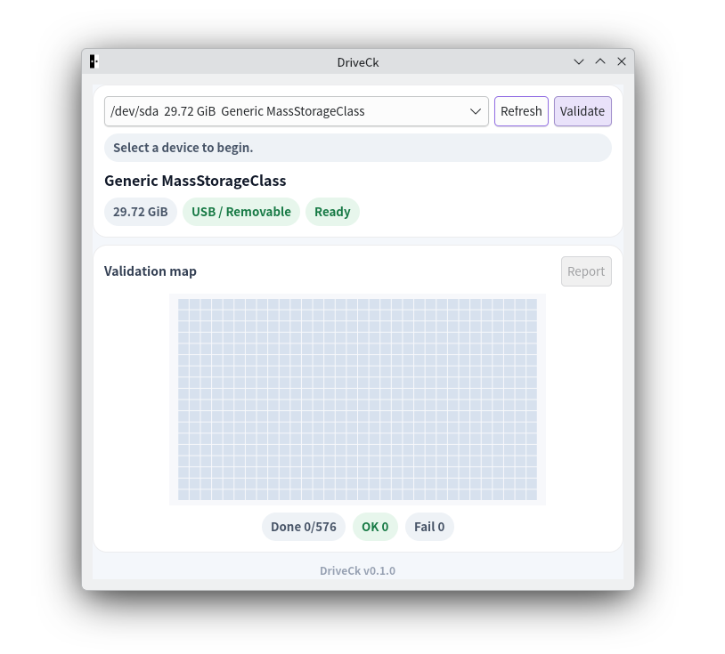
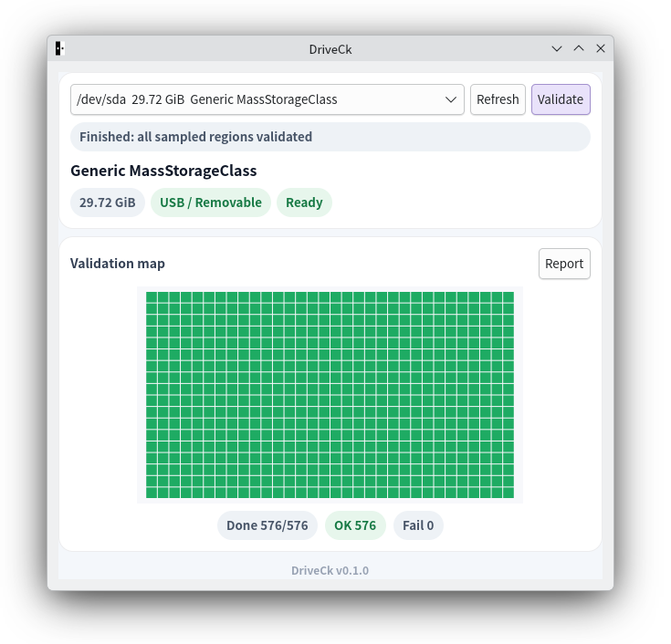
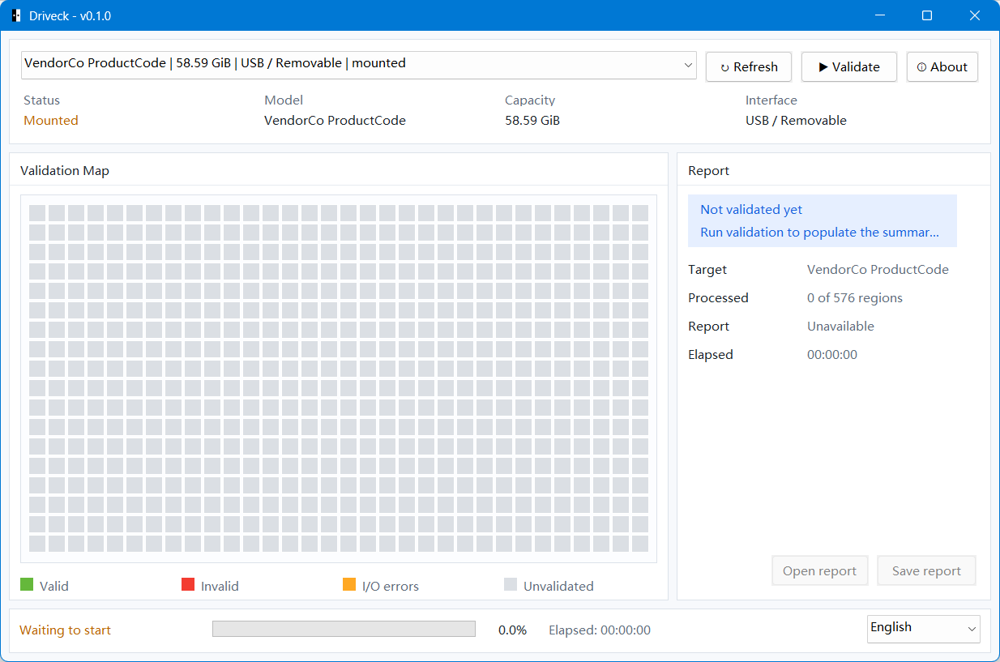
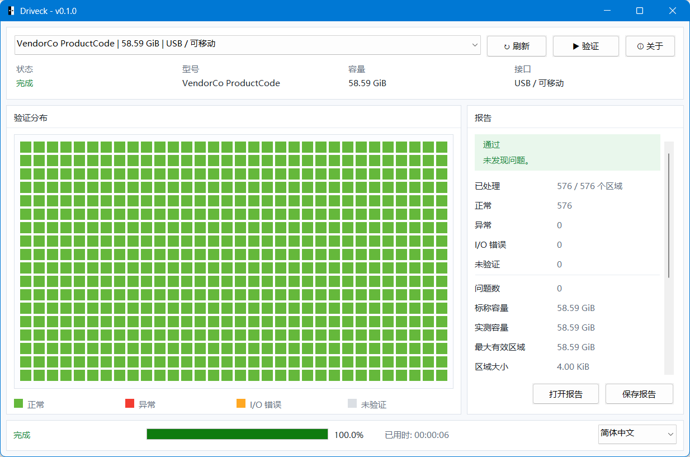
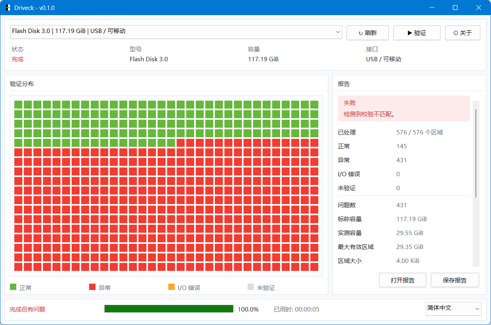

# DriveCk

DriveCk validates removable and USB storage devices, checks read/write
integrity on sampled regions, and generates a human-readable report.

## Platforms

- Linux: GTK GUI and CLI
- macOS: native app and native CLI
- Windows: native Win32 app

## Screenshots

Current screenshots cover the Linux GTK frontend and the native Win32 frontend.

### Linux GTK





### Windows Win32







## Features

- validates removable and USB whole-disk devices
- live 18 x 32 validation grid during a run
- human-readable report with verdict and usable-size summary
- Linux GTK app, Linux CLI, native macOS app/CLI, and native Win32 app

## Before you run it

- Validate only whole devices, not partitions or image files.
- Sampled regions are temporarily overwritten and then restored.
- Unmount the target before validation.
- Raw-device access may require administrator privileges.

## Quick start

### Linux GTK

Run from source:

```bash
cargo run -p driveck-gtk
```

If you use the packaged Linux GTK release, extract the archive and run:

```bash
./driveck
```

When the GTK app needs elevated access on Linux, it requests it through a GUI
authentication prompt.

### CLI

Run from source:

```bash
cargo run -p driveck-cli -- --list
cargo run -p driveck-cli -- --yes /dev/sdb
cargo run -p driveck-cli -- --yes --output report.txt /dev/sdb
```

CLI release packages also extract to a short executable name:

```bash
./driveck --list
./driveck --yes /dev/sdb
```

### Windows Win32

Run from a Windows shell initialized with the MSVC toolchain, such as
Developer PowerShell for VS 2022:

```powershell
cargo run -p driveck-win32
cargo build --release -p driveck-win32
```

If you use the packaged Windows GUI release, extract the archive and run:

```powershell
.\DriveCk.exe
```

To package the Windows release from PowerShell, prefer:

```powershell
.\script\package_release.ps1 win32
```

The Win32 frontend:

- discovers removable and USB whole-disk targets
- blocks mounted disks until every volume on the physical disk has been unmounted
- shows the live validation grid, progress, summary, and report preview during a run

### macOS

- macOS uses native frontends: a SwiftUI + AppKit app and a native CLI.

## Release package names

Release archives are normalized by distribution edition rather than the
frontend implementation detail.

- CLI packages: `DriveCk-cli-<platform>-<arch>-v<version>`
- GUI packages: `DriveCk-gui-<platform>-<arch>-v<version>`

Examples:

- `DriveCk-cli-linux-x86_64-v0.1.0.tar.gz`
- `DriveCk-gui-linux-x86_64-v0.1.0.tar.gz`
- `DriveCk-cli-windows-x86_64-v0.1.0.zip`
- `DriveCk-gui-windows-x86_64-v0.1.0.zip`
- `DriveCk-cli-macos-arm64-v0.1.0.zip`
- `DriveCk-gui-macos-arm64-v0.1.0.zip`

## Developer docs

Build, packaging, and platform-specific developer details now live here:

- [Developer guide](docs/development.md)
- [macOS requirements](docs/macos-requirements.md)
- [macOS design notes](docs/macos-design.md)

## Reference

- [GRC ValiDrive](https://www.grc.com/validrive.htm)
